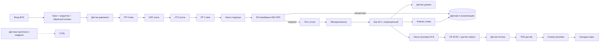

# Техническая документация: водомат семейства из четырёх моделей

Версия 0.2, 2026-10-08, черновик для инженерного ревью, переработан по правилам владельца: это проектная спецификация; числовые параметры без источника заменены на «не найдено» или помечены «предложение, к утверждению владельцем/инженером». Реестр неизвестных — `docs/reports/unknowns-and-open-issues.md` (HW-…). Глубина — полный производственный пакет (решение 0025). Всё, что не подтверждено поставщиком, помечено [уточнить: кого спросить]. Номера Q-n — открытые вопросы, привязаны к строкам сметы (`equipment-cost-estimate.md`). Правку `docs/hardware/initial-technical-spec.md` не вносили; см. этот документ как развитие TECH_SPEC.

## 1. Требования

| № | Требование | Источник |
|---|---|---|
| R1 | Продукт: питьевая вода из городского водопровода, очищенная обратным осмосом, розлив в тару клиента | решение 0002 |
| R2 | Безналичная оплата; наличные не обязательны | решение 0001 |
| R3 | Критерий пилота: ≥50 л/день, аптайм ≥95% 3 месяца | решение владельца 0011 |
| R4 | Принципы: низкая цена, ремонтопригодность, обслуживаемость, наблюдаемость, простая интеграция | решение 0007 |
| R5 | Допуски поставщиков подписываются со штрафами | решение 0008 |
| R6 | Малый непрозрачный бак 20–40 л, УФ, плановый слив | решение 0020 |
| R7 | Обогрев только на уличных моделях | решение 0021 |
| R8 | Четыре модели из одной базы: помещение/улица × стандарт/усиленная | решение 0022 |
| R9 | Камера во всех моделях, по событиям + контрольный снимок | решение 0023 |
| R10 | Автоблокировка розлива при загрязнении, вскрытии, серьёзной неисправности | решение 0024 |
| R11 | Фискализация продаж (ESIR) | факт 0010 |
| R12 | Давление на входе, дренаж, сеть 50 Гц. Значения из TECH_SPEC (давление ≥0,2 МПа, 220 В) источников не имеют; номинал сети и давление — не найдено, подтвердить по паспорту RO-блока и у BVK/ЕПС (HW-08) | TECH_SPEC §1, §11.2 |

## 2. Состав и габариты

- Базовая машина: RO-блок 400 GPD, нижняя часть корпуса; бак 30 л; УФ-модуль; насос розлива; клапаны; контроллер; платёжный модуль; камера; GPS; датчики. Расположение — по TECH_SPEC §9.1, бак меняется на малый (30 л).
- Габариты: не найдено (цифры TECH_SPEC для RO-300A источника не имеют; для модели с баком 30 л — спросить: поставщика корпуса; Q1, HW-09).
- Масса: не найдена (спросить: поставщика; Q2). Вода в полном баке 30 л: 30 л × 1 кг/л ≈ 30 кг (арифметика).
- Модули различий: см. раздел 13 (конфигурации), подробности в `machine-configurations.md`.

## 3. Гидравлическая схема

Гидравлическая схема (текстовая, mermaid):



Примечания.
1. Порядок PP/UDF/CTO/PP, RO, пост-уголь, минерализатор — по TECH_SPEC §2 (исходное описание; по открытым объявлениям число ступеней 8–11, см. факт 0004). Фактический порядок и наличие насоса подпора в блоке — [уточнить: поставщик; Q3].
2. Минерализатор до бака: отсутствие его после УФ упрощает санобработку, но вторичное загрязнение после УФ возможно только на коротком участке до насадки.
3. Концентрат: отношение сброса к пермеату — не найдено (спросить: поставщика RO; в `calculator.py` принято допущение «забор в 4 раза больше проданного», не подтверждено).
4. Слив бака (DV) направляется в тот же дренаж через воздушный разрыв (air gap) [уточнить: BVK, требования к дренажу; Q4].

## 4. Электрическая схема и питание

Электрическая схема (текстовая):

```
~230 В (отдельная линия, счётчик, УЗО, автомат — номиналы по проекту электрика, Q6)
  └─ щиток аппарата
       ├─ БП 24 В DC → насос подпора RO, насос розлива, клапаны (розлив, слив), реле
       ├─ БП 12 В DC → камера, GPS, терминал оплаты, контроллер
       ├─ БП 5 В DC → датчики, ESP32, 4G-модем
       ├─ УФ-балласт (через реле, управляется контроллером)
       ├─ [уличные] ТЭН через термостат + SSR; греющий кабель; обогрев электроники
       └─ резервная батарея 12 В: питание контроллера, модема, сирены при пропаже сети (время автономности и ёмкость — Q5, не определены)
Контроллер (ESP32): входы: датчик потока, давление, уровень, температура ×3, TDS, ток УФ, 2 геркона, акселерометр, датчики протечки ×2, ввод MDB/сигналов терминала; выходы: клапан розлива, клапан слива, насос розлива, насос подпора (по сигналу давления), реле УФ, реле ТЭН, сирена.
```

- Потребление и баланс мощности: **не определены**. Из открытых страниц (2026-10-08) известны только: УФ-лампа 40 Вт (SATEPA UVC40A, https://manelservice.com/en/uv-steriliser/18114-satepa-uv-steriliser-uvc40a-adaptor-with-plug-in-power-supply.html), камера Dahua 4,9 Вт (https://shop.mdpcloud.com/net-camera-2mp-ir-dome-wifi-ipc-hdbw1230de-sw-0280b-dahua-1391443), терминал Nayax 5 Вт (https://shop.nayax.com/vpos-touch.html). Мощности RO-блока (TECH_SPEC даёт 300 Вт без источника), насоса розлива, УФ-балласта, клапанов, ТЭН, греющего кабеля, обогрева электроники и БП — не найдено (HW-06). Таблица баланса, суммарный ток, номинал автомата и сечение кабеля — формулы без значений:

  P_сумма = P_RO + P_насос_розлива + P_УФ_балласт + P_электроника + P_клапаны (+ P_ТЭН + P_кабель + P_обогрев_электроники на улице); I = P_сумма / (U × cos φ); номинал автомата и сечение кабеля выбирает электрик по I (Q6). Среднесуточная энергия = Σ (P_i × t_i).

- Заземление всех металлических частей; корпус из стали, защита от прикосновения к 230 В.
- Расчёт сечения кабелей, номиналов автоматов, схема с позиционными обозначениями — [уточнить: электрик/проектировщик; Q6].

## 5. Механические чертежи и описание корпуса (CAD-описание)

Описание задаёт требования к чертежу, сам CAD-файл выпускает инженер.
- Корпус: стальной каркас (стандарт) и более толстая сталь (усиленная модель), порошковая окраска; толщины, габариты и марки — не найдено, определяет поставщик корпуса (Q7, HW-09; значения 2 мм и 3+ мм в TECH_SPEC источника не имеют); дверь на закрытых петлях или внутренних шарнирах, замок сувальдный, обращённый вниз, защита от поддева кромки двери «язык».
- Панели лицевые: поликарбонат (стандарт); усиленная панель или нерж. сталь с окном (усиленная); толщины — не найдено (спросить: металлообработка; Q7).
- Зоны: нижняя — RO-блок, фильтры, дренаж; средняя — бак, УФ, насосы; верхняя — платёжка, камера, GPS, сирена; отдельный запираемый отсек электроники.
- Отверстия: вход воды, дренаж, ввод 230 В, антенны — через сальники IP65; вентиляция с лабиринтом и сеткой.
- Крепление: анкеры в пол/бетонное основание (число и размер M12×4 — по TECH_SPEC §8, источника нет; расчёт нагрузок — инженер); на усиленных — скрытые головки, дополнительные закладные.
- Уличные: козырёк, уклон крыши, утеплитель и нижний край выше уровня земли (размеры — не найдено, определяет инженер), обогреваемый вход.
- Окна и зоны камеры: обзор на область перед аппаратом и дверь, без записи не относящегося к аппарату пространства (раздел 14, приватность).
- Материалы, контактирующие с водой: пищевые (нерж. 304/316, PE, PP, EPDM, силикон) с декларацией соответствия [уточнить: поставщик; Q8].

## 6. Жгуты и разводка (описание)

| Жгут | Соединяет | Провода/разъёмы | Примечание |
|---|---|---|---|
| W1 силовой 230 В | щиток ↔ БП, УФ-балласт, ТЭН | сечение — по проекту электрика (Q6) | отдельно от сигнальных |
| W2 питание 24 В | БП ↔ насосы, клапаны | сечение — по проекту | предохранители |
| W3 питание 12/5 В | БП ↔ камера, модем, терминал, ESP32 | сечение — по проекту | |
| W4 сигнальный | датчики ↔ ESP32 | экранированная витая пара, разъёмы JST/Molex | DS18B20 по 1-Wire |
| W5 MDB | терминал ↔ контроллер | кабель Nayax; артикул кабеля не найден (на странице https://shop.nayax.com/vpos-touch.html только SKU ST4G «Card Reader Set») | [уточнить: Nayax; Q9] |
| W6 камера | PoE или 12 В + Ethernet | Cat5e | |
| W7 антенны | 4G, GPS | коаксиал SMA | наружу корпуса через сальник |
Маркировка проводов по номерам, схема соединений — приложение к паспорту (Q10).

## 7. Логика управления и режимы отказа (прошивка)

Числовые пороги ниже (допуск объёма, время нет-связи, температуры, возраст воды) — предложение методики, не факт: к утверждению владельцем/инженером после данных поставщика и норм (HW-10).

Состояния: INIT, IDLE, PAYMENT, DISPENSE, FILL, FLUSH, MAINTENANCE, BLOCKED.

| Событие | Реакция |
|---|---|
| Оплата получена | открыть клапан розлива, считать объём по датчику потока, закрыть при достижении; расхождение выше допуска (допуск ±2% из TECH_SPEC §10.3 — предложение) — запись |
| Потеря связи с платёжкой | розлив запрещён [repo: TECH_SPEC §5] |
| Уровень бака < min | запретить розлив; включить подпор RO |
| Возраст воды в баке > T_слив (24 ч — предложение) | плановый слив и пополнение (FLUSH), если нет клиента |
| Возраст воды > T_блок (48 ч — предложение), УФ неисправен, TDS выше порога, протечка, вскрытие двери, наклон, аномалия потока | BLOCKED: розлив запрещён, тревога, камера сохраняет событие (решение 0024, guardrail) |
| Температура воды ниже порога включения (+2 °C — предложение, уличные) | ТЭН включить; ниже 0 °C с ТЭН — BLOCKED |
| Температура воды выше порога (+40 °C из TECH_SPEC §6 — предложение) | аварийное отключение |
| Нет связи дольше порога (60 мин — предложение) | тревога; локально розлив разрешён, если нет других блокировок (решение: [уточнить]; Q11) |
| Watchdog | перезагрузка контроллера при зависании [repo: TECH_SPEC §5] |
| Пропажа сети | батарея: тревога; розлив запрещён |

Выход из BLOCKED — только локально ключом/карточкой сервисника и записью причины в журнал (удалённая разблокировка допустима только для событий без гигиенического риска: потеря связи; Q12). Прошивка: обновление по сети (OTA) с подписью (проектное требование).

Спецификация прошивки (кратко): цикл опроса — по проекту прошивки; запись событий во флеш с отметкой времени NTP; пакеты телеметрии на сервер MQTT/HTTPS TLS; формат полей — в `telemetry.md`.

## 8. Интерфейсы

- Оплата: MDB (терминал класса Nayax VPOS Touch) или API провайдера; детали и сербские эквайеры [уточнить: Nayax, банки; Q13]. Фискализация ESIR: способ встраивания в терминал [уточнить: Налоговая администрация, бухгалтер; Q14].
- Телеметрия: 4G-модем (MQTT или HTTPS); GPS трекер самостоятельный (FMB920).
- Сервисный порт: USB/Serial под замком для прошивки.
- Видео: RTSP локально, события/снимки в облако.

## 9. Монтаж и подключение

- Вода: врезка в холодную линию с запорным краном, обратным клапаном, редуктором; давление — по паспорту RO-блока и данным BVK (не найдено; TECH_SPEC §11.2 даёт цифру без источника); в жилом доме — согласование с управляющей компанией и собственниками [repo: TECH_SPEC §11.1]; требования BVK [уточнить: BVK Surčin; Q15].
- Дренаж: сброс концентрата и слива бака в канализацию через сифон и воздушный разрыв; для улицы — утеплённая линия; согласование — Q16.
- Электричество: отдельная линия 230 В с УЗО 30 мА, отдельный счётчик (факт 0006).
- Анкеровка: анкеры в основание (число и размер — инженер); для улицы — бетонная плита.
- Улица: траншеи и согласование с городом (разрешение на размещение) [repo: pilot_implementation §5] — для пилота предпочтительна внутренняя точка.
- Приёмка монтажа: герметичность при рабочем давлении (время выдержки — предложение методики), проверка заземления, измерение сопротивления изоляции.

## 10. Регламент обслуживания и санобработки

Интервалы ниже взяты из TECH_SPEC §2 и прежней версии — предложение методики, не факт (нормы и ресурсы фильтров поставщика не найдены; HW-11). Ресурс УФ-лампы 9 000 ч — по странице SATEPA.

| Интервал | Операция |
|---|---|
| Ежедневно (телеметрия) | контроль возраста воды, TDS, УФ, температуры, протечек |
| Еженедельно (первые 3 мес.), затем раз в 2 нед. | выезд/осмотр, протирка насадки и дверцы, проверка тары, ATP-тест выхода |
| Ежемесячно | санобработка бака и линии пищевым раствором, промывка; проверка ТЭН и кабелей (уличные) |
| Раз в 3 мес. | замена PP 5 мкм и PP 1 мкм [repo: TECH_SPEC §2] |
| Раз в 6 мес. | замена UDF, CTO, пост-угля |
| Раз в 12 мес. (УФ-лампа: 9 000 ч ≈ 375 суток непрерывной работы) | замена минерализатора и УФ-лампы, осмотр кварцевой гильзы |
| Раз в 24–36 мес. | замена мембраны [repo] |
| Раз в 3–6 мес. | микробиология и физхимия в лаборатории (дорожка sampling) [уточнить: интервал по норме] |
| Сезонно | смена режима лето/зима (уличные) |

Журнал: дата, оператор, операция, показания (TDS, давление, расход), серийные номера фильтров, фото до/после. Бумажный дубль в аппарате + электронный в платформе (Q17). Утилизация концентрата — по нормам [repo: TECH_SPEC §11.3].

## 11. Приёмочные испытания

Основа — TECH_SPEC §10.2–10.3, расширено.

Функциональные: розлив 5 л без протечек; точность розлива в допуске; оплата картой успешна; телеметрия идёт; GPS; камера: запись события при открытии двери, наклоне, вибрации; датчики температуры; ТЭН включается при падении ниже порога температуры (уличные); замок; анкеры.
Дополнительные (решение 0020–0024):
- бак: непрозрачность, слив из нижней точки, корректная работа датчика уровня; плановый слив выполняется;
- УФ: отключение лампы вызывает BLOCKED за заданное время (время не определено);
- протечка (пролив на датчик) вызывает BLOCKED;
- открытие двери без ключа вызывает BLOCKED и тревогу;
- наклон выше порога (порог не определён, HW-10) вызывает BLOCKED;
- имитация аномалии потока (нет расхода при открытом клапане) вызывает BLOCKED;
- пропажа сети: тревога от батареи;
- микробиология воды у насадки по норме (протокол лаборатории, дорожка sampling/certification);
- уличные: холодная камера (если доступна) или полевой тест ниже +2 °C.
Критерии приёмки (из TECH_SPEC §10.3, предложение, к утверждению): время реакции на тревогу, точность розлива, доля успешных оплат, доступность телеметрии — численные значения TECH_SPEC источников не имеют (HW-10).

## 12. Документы, которые нужно получить от поставщика

1. Паспорт и инструкция; чертёж габаритов и масса.
2. Подтверждение количества ступеней, модели мембраны, бака (объём, материал, непрозрачность).
3. Сертификаты пищевого контакта на материалы (бак, трубки, клапаны, насосы).
4. Гидравлическая и электрическая схемы поставщика; перечень комплектующих с моделями.
5. Условия производительности 400 GPD (температура, давление, TDS).
6. Протокол MDB/API терминала; документы фискализации.
7. Гарантия, перечень запчастей, сроки поставки; допуски и штрафы (решение 0008).
8. Декларации CE/RoHS/ЭМС на электрику; сертификаты УЗО.
9. Протоколы заводских испытаний.

## 13. Различия конфигураций (сводка)

| Узел | IN-STD | IN-REI | OUT-STD | OUT-REI |
|---|---|---|---|---|
| Корпус | стандартный стальной | усиленный | стандартный + утепление + козырёк | усиленный + утепление |
| Обогрев | нет | нет | да (решение 0021) | да |
| Камера | да | да | да | да |
| Акселерометр, герконы | да | да | да | да |
| Крепление | анкеры | скрытое, усиленное | бетонная плита | бетон + скрытое |
| Замок | сувальдный | бронированный | сувальдный | бронированный |

## 14. Приватность и данные камеры

Камера направлена на аппарат и зону розлива; запись по событиям; маскирование посторонних зон; срок хранения: **не найден** (30 суток в решении 0023 — ориентир владельца, нормой не подтверждён). Статья 021.rs (https://www.021.rs/story/Info/Srbija/383361/Kamere-na-svakom-cosku-i-ugrozavanje-privatnosti-Kako-se-regulise-video-nadzor-u-Srbiji.html, проверена 2026-10-08) срок хранения не называет; норма в законе не найдена. Закон о защите данных о личности требует хранить не дольше, чем нужно для цели (принцип ограничения хранения) [web, выдача поиска, первоисточник не открыт: Sl. glasnik RS 87/2018], конкретное число — не найдено (спросить: юрист, Повереник за информације од јавног значаја и заштиту података о личности; Q18, HW-12). Подробности — `telemetry.md`.

## 15. Открытые вопросы (привязаны к сметe)

| Q | Вопрос | Кого спросить | Строка сметы |
|---|---|---|---|
| Q1 | Габариты корпуса с баком 30 л | поставщик RO | H1, C1 |
| Q2 | Масса | поставщик RO | H1 |
| Q3 | Порядок ступеней, наличие насоса подпора | поставщик RO | H1 |
| Q4 | Требования BVK к дренажу и воздушному разрыву | BVK | I2 |
| Q5 | Ёмкость батареи | электрик | E4 |
| Q6 | Электрический проект | электрик | E1–E3 |
| Q7 | Панели усиленной модели | металлообработка | C2 |
| Q8 | Сертификаты материалов | поставщик | H2, H13 |
| Q9 | MDB-кабель, версия терминала | Nayax | P1, P2 |
| Q10 | Маркировка жгутов | сборщик | I4 |
| Q11 | Работа без связи | владелец (решение) | T2 |
| Q12 | Удалённая разблокировка | владелец (решение) | T8 |
| Q13 | Эквайринг Сербия | Nayax, банки | P1 |
| Q14 | ESIR | Налоговая администрация, бухгалтер | P3 |
| Q15 | Условия врезки | BVK | I1 |
| Q16 | Согласование дренажа | BVK, хозяин площадки | I2 |
| Q17 | Формат журнала | владелец | K1 |
| Q18 | Срок хранения видео | Повереник, юрист | T3 |
