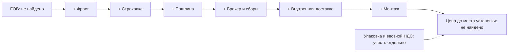
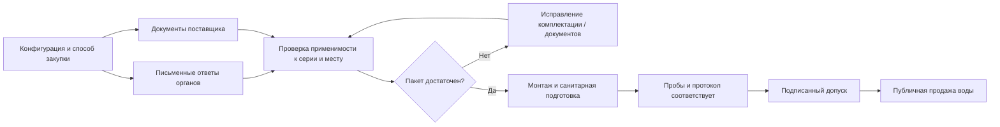
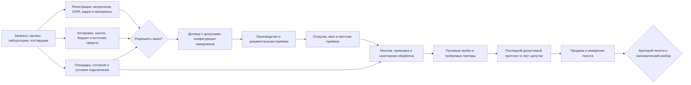
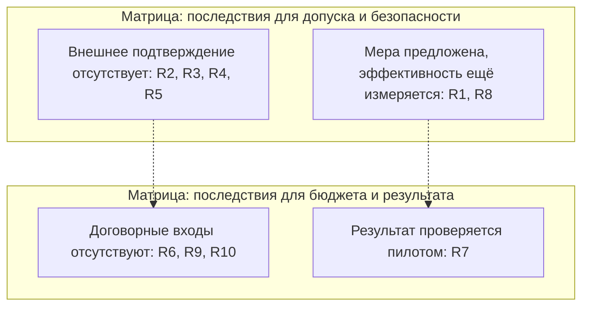

# Пилот водомата в Сурчине: экономика и допуск к запуску

Материал для обсуждения владельцем, потенциальным инвестором и командой запуска. Чек-лист сертификации вынесен на отдельный слайд. Подробные расчёты, ограничения источников и контрольные документы — в [приложении](presentation-appendix.md); приоритеты исправлений — в [аудите](audit-report.md).

Обозначения: **источник** — сохранённый документ с указанным охватом; **решение** — выбор проекта, а не рыночный факт; **предложение** — методика для согласования. Ссылки на решения ведут на действующую редакцию файла; их статус в базе — «черновик». Числовые подписи слайдов, пунктов и писем — навигация.

---

## Слайд 1. Цель пилота и критерий прохождения

**Проверить спрос, доступность и реальные расходы на одном аппарате у жилого дома в Сурчине.** Площадка ещё не выбрана. [decision: 0003](docs/decisions/0003-residential-single-point-pilot.md)

| Что проверяем | Критерий / результат |
|---|---|
| Спрос | Среднее **≥50 л/день**. [decision: 0011](docs/decisions/0011-pilot-gate.md) |
| Доступность | **≥95%** времени аппарат доступен покупателю. Порядок учёта защитных блокировок предстоит утвердить. [decision: 0011](docs/decisions/0011-pilot-gate.md) |
| Длительность | Оба критерия выполняются **3 месяца подряд**. [decision: 0011](docs/decisions/0011-pilot-gate.md) |
| Аудитория продукта | Жители рядом с точкой, покупающие воду в свою тару; оплата безналичная. [decision: 0003](docs/decisions/0003-residential-single-point-pilot.md), [decision: 0001](docs/decisions/0001-cashless-first.md) |

До прохождения критерия расходы на масштабирование отложены. Прохождение проверяет спрос и надёжность; экономическую состоятельность нужно подтвердить расчётом по измеренным расходам. [decision: 0011](docs/decisions/0011-pilot-gate.md)

Заметки докладчика

**Ключевые тезисы.** Пилот должен дать журнал продаж, забор воды, расход электричества, причины блокировок и фактические счета. Предложение аудита: защитные блокировки учитывать в доступности покупателю и отдельно разбирать по причинам; утвердить методику до запуска.

**Ожидаемые вопросы.** «Это порог окупаемости?» — Нет, безубыточность пока не найдена. «Можно уже покупать аппараты для сети?» — Решение о расходах на масштабирование отложено до критерия пилота. [decision: 0011](docs/decisions/0011-pilot-gate.md)

---

## Слайд 2. Экономика: подтверждённые входы и неизвестное

| Вход | Что известно | Что осталось получить / у кого |
|---|---|---|
| Цена покупателю, p | **50 RSD / 5 л = 10 RSD/л**. [decision: 0004](docs/decisions/0004-single-price-first.md) | Включение НДС в цену — не найдено; владелец и бухгалтер |
| Вода на литр **забора** | **158,09 RSD/м³ = 0,15809 RSD/л ≈0,158 RSD/л**, с НДС, категория «прочие потребители»; вторичный источник. [source: material/economics/web-archive/beograduzivo.rs_8f518c21](material/economics/web-archive/beograduzivo.rs_8f518c21) | Применимая категория водомата — не найдено; BVK |
| Водоотведение | **85,07 RSD/м³ = 0,08507 RSD/л**. [source: material/economics/web-archive/beograduzivo.rs_8f518c21](material/economics/web-archive/beograduzivo.rs_8f518c21) | Объём начисления и фиксированная часть счёта — не найдено; BVK |
| Вклад с литра | В отчётах: «**<9,84 RSD/л**». Точный предел до остальных расходов: **c ≤9,84191 RSD/л**, при заборе не меньше продажи и неотрицательных затратах; это арифметика, не прогноз маржи. [decision: 0004](docs/decisions/0004-single-price-first.md), [source: material/economics/web-archive/beograduzivo.rs_8f518c21](material/economics/web-archive/beograduzivo.rs_8f518c21) | Реальный c — не найдено; нужны k, комиссия, налоговый режим и другие переменные расходы |
| CAPEX | **Не найдено**: полный аппарат, ввоз, интеграция, монтаж и допуск | Поставщики, брокер, интегратор, лаборатория |
| OPEX и аренда | **Не найдено**: согласованный полный состав и суммы | Собственник, сервис, лаборатория, операторы связи, EPS |
| k / f / t | **Не найдено**: забор на проданный литр / комиссия платежей / эффективная доля налоговых удержаний из цены | Поставщик и измерения / эквайер / бухгалтер |

**Прибыль, безубыточность и окупаемость: не найдено.** Стоимость воды на заборе нельзя выдавать за полную себестоимость проданного литра.

Заметки докладчика

**Ключевые тезисы.** Коэффициент k включает концентрат и технологические сливы. Фильтры, электричество и пробы классифицируются по реальному договору и расходу. Известный тариф не подтверждает всю экономику.

**Ожидаемые вопросы.** «Почему поправили знак у вклада?» — Строгое неравенство с округлённой границей из отчётов математически не гарантировано; точная граница приведена в таблице. «Почему нет итогового бюджета?» — Пропущенные цены нельзя считать бесплатными.

---

## Слайд 3. Стоимость аппарата: каскад до места установки

**Цена до места установки = FOB + фрахт + страховка + пошлина + брокер + внутренняя доставка + монтаж**, с отдельным учётом упаковки, портовых/складских сборов и ввозного НДС. Сравнивать одинаковую комплектацию. [decision: 0012](docs/decisions/0012-pilot-machine-sourcing.md)

| Ступень | Подтверждённый диапазон / статус | Кого спросить |
|---|---|---|
| FOB выбранной конфигурации | **Не найдено**. Каталожные ориентиры: Tinotec **850–1 050 USD**; Oulepu **500–1 000 USD**. Это разные аппараты, без согласованной комплектации и условия поставки. [source: material/economics/prices/tinotec.en.made-in-china.com_3e3cd72d.html](material/economics/prices/tinotec.en.made-in-china.com_3e3cd72d.html), [source: material/economics/prices/oulepu.en.made-in-china.com_efaae641.html](material/economics/prices/oulepu.en.made-in-china.com_efaae641.html) | Поставщики: котировка и перечень включённых узлов |
| Фрахт | **Не найдено**: архив содержит главную страницу, без подтверждения маршрута и ставок. [source: material/economics/prices/goodhopefreight.com_b81a525d](material/economics/prices/goodhopefreight.com_b81a525d) | Форвардер: маршрут, масса, объём, сборы по концам |
| Страховка | **Не найдено**: загрузка источника завершилась ошибкой. [source: material/sources-registry.csv](material/sources-registry.csv) | Страховщик / форвардер: ставка и страховая база |
| Пошлина | **Не найдено**: код, происхождение и льготный режим не подтверждены | Таможенный брокер |
| Брокер | **Не найдено** для коммерческой поставки аппарата | Брокер: полный состав услуг |
| Внутренняя доставка | **Не найдено** | Перевозчик: разгрузка, подъём и доставка до площадки |
| Монтаж и пусконаладка | **Не найдено** | Интегратор, сантехник, электрик |
| Итог до места установки | **Не найдено**; частичная сумма компонентов не является итогом | Закупщик сводит сопоставимые котировки |

Каскад показывает накопление затрат; денежная высота ступеней не определена. Ввозной НДС отражать в потребности в денежных средствах; возможность его вычета — не найдено, уточняет бухгалтер.

Заметки докладчика

**Ключевые тезисы.** Старые итоги перевозки исключены из презентации из-за неполной доказательной базы. Для цены до места установки нужны упаковочные параметры и условия поставки. Дополнительный модуль нельзя прибавлять к цене аппарата, пока не проверено, входит ли он в комплектацию.

**Ожидаемые вопросы.** «Можно назвать минимальную цену запуска?» — Нет: не получена даже котировка аппарата под требования пилота. «На схеме отсутствует сертификация?» — Она добавляется к бюджету запуска отдельно от доставки и монтажа.

---

## Слайд 4. Альтернативы закупки: A → B → D → C

| Вариант | Возможные преимущества | Недостатки / условие применимости | Цена и следующий запрос |
|---|---|---|---|
| **A — Китай** | Прямой контакт с производителем; опубликованы каталожные цены | Документы, совместимость платежей, ввоз и местный сервис требуют проверки; изменение конструкции может изменить обязанности оператора | FOB пилотной конфигурации — **не найдено**; запросить аппарат, документы и приёмку |
| **B — локальный поставщик** | Возможность местного сервиса и поставки с оформленными документами | Наличие, документальная ответственность и условия ремонта не подтверждены; зависимость от поставщика | **Не найдено**; письменная котировка и договор сервиса |
| **D — европейский канал / ЕС** | Возможность комплектного технического досье | Сербский допуск, происхождение и нужная комплектация требуют проверки; каталог другого класса не сопоставим с A | Ecosoft Aquabox: **6 541,67 EUR без НДС**, каталог; поставка в Сербию — **не найдено**. [source: material/hardware/web-archive/ecosoft.com_22d4885d](material/hardware/web-archive/ecosoft.com_22d4885d) |
| **C — собственная сборка** | Контроль конструкции и ремонтопригодности | Инженерия, испытания, документы и ответственность производителя; экономия не доказана | Полная смета — **не найдено**; запросить компоненты, труд и испытания |

**Правило выбора:** сопоставимые котировки A/B/D по полной стоимости, документам и сервису; при небольшой разнице предпочесть B/D, иначе A с подписанными допусками и штрафами. Порог разницы **не найдено** — выбирает владелец после котировок. Старый коэффициент **«~2×» не действует как утверждённый порог**. [decision: 0012](docs/decisions/0012-pilot-machine-sourcing.md), [decision: 0008](docs/decisions/0008-signed-tolerances-with-penalties.md)

Сборка для пилота отложена; пересмотр от **≥20 точек** — условный выбор проекта, без доказанного порога экономии. [decision: 0040](docs/decisions/0040-certification-buy-vs-make.md)

Заметки докладчика

**Ключевые тезисы.** Преимущества B/D являются условиями предложения поставщика, а не установленными фактами. Европейский канал не подтверждает происхождение конкретного изделия. Замена бака и модулей требует проверки сохранения документов на конфигурацию.

**Ожидаемые вопросы.** «Уже выбран B?» — Нет, реестр котировок пуст. «Почему нет процентного рейтинга?» — Цена, сроки, документы и сервис пока не получены. [source: material/economics/correspondence/rfq-tracking.md](material/economics/correspondence/rfq-tracking.md)

---

## Слайд 5. Финмодель и финансирование

**Расчётная конструкция; денежный итог появится после заполнения входов.**

| Расчёт | Формула / условие |
|---|---|
| Вода и стоки на литр продажи | **w = k × a + b × q**, где a — тариф воды на забор, b — тариф стоков, q — начисляемые литры стоков на литр продажи; q определяет BVK |
| Вклад | **c = p × (1 − f − t) − w − v**, где v — другие переменные расходы, t — эффективное удержание из цены, а не автоматически ставка НДС |
| Операционный денежный результат | **P = D × V × c − F**, D — фактические дни периода, V — средние продажи за календарный день, F — постоянные денежные расходы |
| Безубыточность / возврат вложений | **V\* = F / (D × c)** при положительном c; **M = CAPEX / P** при положительном P. M — простой срок возврата при стабильном месячном результате, до финансирования |
| Если цена включает НДС | **p_нетто = p / (1 + r)**; соответствующая доля из цены **t_НДС = r / (1 + r)**. Ставка r и режим — **не найдено**, бухгалтер |

Основа цены — [decision: 0004](docs/decisions/0004-single-price-first.md); основа тарифов — [source: material/economics/web-archive/beograduzivo.rs_8f518c21](material/economics/web-archive/beograduzivo.rs_8f518c21). Единицы и условия формул раскрыты в [приложении](presentation-appendix.md#финансовые-формулы-и-границы).

**Главные драйверы:** аренда и анализы → F; k и технологические сливы → w; эквайринг → f; налоговый режим → чистая цена и учёт затрат; спрос и доступность → V. Амортизация и платежи по кредиту показываются отдельно.

| Источник средств | Подтверждённое / неизвестное |
|---|---|
| Свои средства | Доступная сумма, предел потерь и резерв — **не найдено**; решение владельца после полной сметы |
| **Kapital za razvoj** | Кредит на оборудование: **700 000–15 000 000 RSD**, собственное участие **≥30%**, заёмщик платит **2% годовых**, срок до **60 месяцев**. [source: material/economics/documents/ras.gov.rs_f448816b](material/economics/documents/ras.gov.rs_f448816b), [официальная страница RAS](https://ras.gov.rs/javni-poziv-program-kapital-za-razvoj) |
| Доступность кредита | Право новой компании с иностранным владельцем — **не найдено**; запросить RAS и банк. Условие классификации по отчётности за **2025 год** требует проверки применимости к новому юрлицу. [source: material/economics/documents/ras.gov.rs_f448816b](material/economics/documents/ras.gov.rs_f448816b) |

Сумма кредита не включается в доход от продажи воды. Возможность финансирования не подтверждает жизнеспособность точки.

Заметки докладчика

**Ключевые тезисы.** Формулы исправляют упрощение налога в старых отчётах. Одинаковый режим НДС применяем к доходам и расходам. P — операционный результат, а не чистая бухгалтерская прибыль. Погашение тела кредита проверяем в денежном потоке.

**Ожидаемые вопросы.** «Участие в программе гарантировано?» — Нет, требуется решение RAS/банка. «Можно рассчитать окупаемость по цене каталога?» — Нет: полный CAPEX и P неизвестны.

---

## Слайд 6. Сертификация: карта доменов и блокирующие вопросы

Это рабочая карта **семи доменов**, сгруппированных по [карте требований](docs/certification/requirements-map.md); применение к выбранному аппарату устанавливается по письменным ответам. Путь «покупаем» условный. [decision: 0040](docs/decisions/0040-certification-buy-vs-make.md)

| Домен | Подтверждение для допуска | Пробел / адресат |
|---|---|---|
| Вода и санитарный статус | Протокол воды и документ о применимом порядке регистрации | **Кто регистрирует аппарат / место — не найдено**; Минздрав, санитарная инспекция |
| Контактные материалы | Документы на все контактные части выбранной серии | Признание документов и применимость к воде — **не найдено**; Минздрав |
| Электрооборудование и радио | Документы на изделие и встроенные модули | **Радиорежим на дату ввоза — не найдено**; RATEL / орган оценки |
| Метрология | Допуск узла и поверка либо письменное исключение | **Контроль дозатора — не найдено**; DMDM |
| Фискализация | Допустимое решение, регистрация устройства и точки | **ESIR для выбранного безналичного водомата — не найдено**; PURS, интегратор |
| Деятельность и налоги | Регистрация юрлица, код деятельности, режим учёта | Код и режим — **не найдено**; APR, бухгалтер |
| Монтаж и размещение | Договор площадки, вода/стоки, электро, право размещения | Условия и цены — **не найдено**; BVK, собственник, муниципалитет |

Состав вопросов и адресатов: [source: material/certification/correspondence/letters-template.md](material/certification/correspondence/letters-template.md). Сохранённая страница RATEL не закрывает применимость требований к выбранным модулям: [source: material/certification/documents/ratel.rs_f8489920](material/certification/documents/ratel.rs_f8489920), [официальная страница RATEL](https://www.ratel.rs/sr/radio-oprema).

Нет подтверждения единого «мастер-сертификата», заменяющего все домены; повторное использование документов типа — предложение методики. [decision: 0041](docs/decisions/0041-master-certification-and-config-change.md)

Заметки докладчика

**Ключевые тезисы.** Документы изделия и согласования места дополняют друг друга. Покупка не снимает обязанности оператора. Санитарные испытания и технический пуск проводятся до открытия публичной продажи.

**Ожидаемые вопросы.** «CE достаточно?» — Полнота сербского пакета для конфигурации не найдена. «Когда радио станет проще?» — Не закладываем переходную дату из вторичного источника в обязательный график; спрашиваем RATEL.

---

## Слайд 7. Допуск к запуску: чек-лист

**Внутренняя процедура из 14 пунктов; не перечень универсальных требований закона.** Пункты **1–12 и 14** закрываются до публичной продажи, страхование в пункте **13** — по решению владельца для пути «покупаем». [decision: 0040](docs/decisions/0040-certification-buy-vs-make.md), [чек-лист проекта](docs/certification/costs-and-timeline.md)

| № | Подтверждение | № | Подтверждение |
|---|---|---|---|
| 1 | Реестр: конфигурация и серийный номер | 8 | Санитарный ответ: разрешение либо подтверждение неприменимости |
| 2 | Декларация электрооборудования и протоколы | 9 | Юрлицо, код деятельности, договор и согласия площадки |
| 3 | Радиодокументы на модули и изделие | 10 | Условия воды, стоков и электро; отдельный учёт |
| 4 | Документы на контактные материалы серии | 11 | Заводская и местная приёмка; лист допусков |
| 5 | Метрология: ответ DMDM и применимые документы | 12 | Журнал фильтров, график проб, ответственные |
| 6 | ESIR и регистрация по ответу PURS | 13 | Страхование: решение и полис, если выбран |
| 7 | Протокол лаборатории на воду по месту | 14 | Лист допуска: подписи ответственного и основателя |

**Закрытие пункта:** файл доказательства, проверенная применимость, проверивший и подпись. Общий статус подписанного допуска — **не найдено**; запросить владельца и ответственного за соответствие. Пустой пункт или отсутствие ответа не означает освобождения от требования.

Заметки докладчика

**Ключевые тезисы.** Чек-лист воспроизводит внутреннюю процедуру, на которую ссылается решение; при ответах органов его следует пересмотреть. Письменный отказ органа от компетенции требует перенаправления запроса, если применимость обязательства не выяснена.

**Ожидаемые вопросы.** «Все пункты являются требованиями закона?» — Нет, это контрольный пакет проекта. «Можно взять пробы до листа допуска?» — Да, лист регулирует публичную продажу; монтаж, промывка и отбор предшествуют ему.

---

## Слайд 8. Переговоры: письма, приоритеты и статусы

В реестре **12 направлений запросов**, включая лабораторию, бухгалтера и поставщиков; это не исключительно письма госорганам и не число фактических отправлений. **Все отмечены «не отправлено»**, даты и файлы ответов пусты. [source: material/certification/correspondence/authority-tracking.md](material/certification/correspondence/authority-tracking.md)

| Письмо | Адресат / результат | Приоритет до зависимого действия | Статус |
|---|---|---|---|
| 1 | Минздрав / санитарная инспекция: регистрация, программа анализов, материалы | Блокирует выбор и запуск | Не отправлено |
| 2 | Минсельхоз / Минздрав: применимость пищевого законодательства | Параллельно; закрыть до допуска | Не отправлено |
| 3 | DMDM: метрология дозатора, документы, цена и сроки | Блокирует заказ дозирующего узла | Не отправлено |
| 4 | PURS: ESIR, регистрация точки, совместимость | Блокирует заказ платёжного решения | Не отправлено |
| 5 | RATEL: радио на дату ввоза | Закрыть до заказа модулей | Не отправлено |
| 6 | Технические органы: электро, давление, обязанности импортёра | Закрыть до договора и отгрузки | Не отправлено |
| 7 | ГЗЈЗ / лаборатории: прайс, состав, отбор, сроки | Блокирует бюджет и программу проб | Не отправлено |
| 8 | BVK: подключение и концентрат | Закрыть до монтажа и расчёта w | Не отправлено |
| 9 | Сурчин / Белград: размещение и согласия | Закрыть до монтажа | Не отправлено |
| 10 | Повереник: камера, хранение и уведомления | Параллельно; до записи видео | Не отправлено |
| 11 | APR / бухгалтер: деятельность, НДС, учёт | **До аванса и ввоза**, параллельно запросам | Не отправлено |
| 12 | Поставщики: котировки и документы | Немедленно параллельно органам | Не отправлено |

Номера и текущие статусы: [source: material/certification/correspondence/authority-tracking.md](material/certification/correspondence/authority-tracking.md). Приоритеты — предложение аудита; налоговый ответ нужен до финансового обязательства.

**Контроль статусов:** назначен владелец → отправлено с подтверждением → ответ получен → разобран → вопрос закрыт со ссылкой на файл. Срок ответа и дата повторного контакта — **не найдено**, согласовать с каждым адресатом. Шаблоны: [source: material/certification/correspondence/letters-template.md](material/certification/correspondence/letters-template.md).

Заметки докладчика

**Ключевые тезисы.** Запрос готов, но доказательства отправки нет. Подписание договоров и назначения владельцев требуют действия основателя. Предлагаемый внутренний владелец переписки — ответственный за соответствие; закупочных запросов — закупщик.

**Ожидаемые вопросы.** «Органы уже отвечают?» — В реестре ответов нет. «Что считать закрытием?» — Ответ применён к конфигурации и месту, приложен к допуску, соответствующий неизвестный вход устранён.

---

## Слайд 9. Пробы воды: точки, выборка, стоимость

**P1** — вход; **P2** — выход RO до бака; **P3** — слив бака; **P4** — насадка после УФ. Это предложение программы, привязанное к баку **30 л** и УФ после него. [decision: 0020](docs/decisions/0020-small-opaque-buffer-tank.md), [decision: 0050](docs/decisions/0050-sampling-program-stages.md)

**K = max(Z, ceil(N/10))** — предложение для химии по кластерам, не норма: N — аппараты, Z — охват независимых групп «источник + конфигурация», фактический Z **не найдено**. Пуск и микробиология охватывают каждый аппарат. Разбиение кластеров согласовать с лабораторией и инспекцией. [decision: 0051](docs/decisions/0051-sampling-rule-for-n-points.md)

| Аппаратов N | K при условном Z=1 | Пуск, RSD | Месячный ориентир, RSD |
|---|---|---|---|
| 1 | 1 | 34 300 | 4 962,50 |
| 5 | 1 | 81 500 | 16 695,83 |
| 20 | 2 | 281 000 | 62 725,00 |
| 50 | 5 | 702 500 | 156 812,50 |

Вся числовая таблица — арифметика программы [decision: 0050](docs/decisions/0050-sampling-program-stages.md), [decision: 0051](docs/decisions/0051-sampling-rule-for-n-points.md) по [source: material/sampling/web-archive/zjz.org.rs_fb84c1f6.pdf](material/sampling/web-archive/zjz.org.rs_fb84c1f6.pdf). **Шабац, без налога, только найденные позиции; не прайс Белграда и не полный бюджет.** Месячный режим: микробиология ежемесячно; редкие анализы распределены по месяцам для бюджета. Формулы и количество проб — в [приложении](presentation-appendix.md#расчёт-проб-воды).

**План лабораторий:** ГЗЈЗ Белград — запрос процедуры и полного прайса; Батут — проверить область микробиологии; BVK — физико-химия; SuperLab — резерв после проверки актуальной области и состава услуг. Архивные документы не заменяют подтверждение на дату договора. [source: material/sampling/web-archive/zdravlje.org.rs_e72f6609.pdf](material/sampling/web-archive/zdravlje.org.rs_e72f6609.pdf), [source: material/sampling/documents/batut.org.rs_5c4e57a3.pdf](material/sampling/documents/batut.org.rs_5c4e57a3.pdf), [source: material/sampling/documents/bvk.rs_2527bb48.pdf](material/sampling/documents/bvk.rs_2527bb48.pdf), [source: material/sampling/certificates/super-lab.com_50c8152a.pdf](material/sampling/certificates/super-lab.com_50c8152a.pdf).

Смывы, белградский выезд, доставка, полный применимый пакет и внеплановые события — **не найдено**; лаборатория и инспекция. Сначала согласование программы и договора, затем пусковые пробы, повторы и протокол допуска.

Заметки докладчика

**Ключевые тезисы.** Условный Z не измеренный вход. Таблица показывает механизм роста затрат по существующей методике, а не разрешение закупать сеть. Цены химических показателей, которые ошибочно считались отсутствующими, раскрыты в приложении; полнота программы ещё не подтверждена.

**Ожидаемые вопросы.** «Это гарантированная нижняя цена Белграда?» — Нет, это неполная сумма по иному прайсу. «TDS заменяет микробиологию?» — Нет, лабораторный протокол и местная гигиена остаются самостоятельными условиями.

---

## Слайд 10. Критический путь: зависимости и контрольные решения

Это схема зависимостей. **Длительности не найдены; математически самый длинный путь и календарная дата запуска пока не вычислены.** Порядок опирается на условный путь закупки и допуск. [decision: 0040](docs/decisions/0040-certification-buy-vs-make.md), [decision: 0008](docs/decisions/0008-signed-tolerances-with-penalties.md)

| Контрольная точка | Крайний момент / календарный статус | Предлагаемый владелец |
|---|---|---|
| Зафиксировать бюджет, налоги, путь допуска и критерий выбора | До аванса; дата **не найдено**, основатель | Основатель + бухгалтер + ответственный за соответствие |
| Проверить комплектность и документы серии | До отгрузки и остатка платежа. [decision: 0040](docs/decisions/0040-certification-buy-vs-make.md) | Закупщик + инженер |
| Получить последний протокол | По инструкции ГЗЈЗ **7 и более дней с приёма пробы**; срок для выбранного договора уточнить. [source: material/sampling/web-archive/zdravlje.org.rs_e72f6609.pdf](material/sampling/web-archive/zdravlje.org.rs_e72f6609.pdf), [инструкция ГЗЈЗ](https://www.zdravlje.org.rs/files/Dokumenta/Uputstvo-za-uzorkovanje-vode-2023-lat.pdf) | Ответственный за качество |
| Проверить срок программы финансирования | **30.11.2026** — сообщение о продлении во вторичном источнике; актуальный срок у RAS/банка **не найдено**. [source: material/economics/web-archive/podunavlje.info_9e6d3b65](material/economics/web-archive/podunavlje.info_9e6d3b65) | Основатель + бухгалтер |
| Завершить наблюдение пилота | **3 последовательных месяца** с момента допуска и продаж. [decision: 0011](docs/decisions/0011-pilot-gate.md) | Основатель + эксплуатация |

Заметки докладчика

**Ключевые тезисы.** Дедлайны выражены моментом принятия обязательства там, где календарь неизвестен. Срок лаборатории отсчитывается от приёма последней требуемой пробы; это нижняя длительность обработки, а не обещанная дата запуска. После ответов поставить длительности и рассчитать календарный путь.

**Ожидаемые вопросы.** «Запуск успевает к сроку кредита?» — Не найдено: сроки поставки и допуска неизвестны. «Кто назначает даты?» — Основатель после ответов адресатов и договорных сроков.

---

## Слайд 11. Основные риски: меры и владельцы

| ID | Риск | Мера снижения / свидетельство закрытия | Предлагаемый владелец |
|---|---|---|---|
| R1 | Загрязнение бака или насадки | Автоблокировка, санитарная процедура, согласованные пробы и допустимый протокол. [decision: 0024](docs/decisions/0024-auto-block-on-hygiene-alarm.md), [decision: 0050](docs/decisions/0050-sampling-program-stages.md) | Ответственный за качество |
| R2 | Неясный санитарный путь | Письменный ответ о регистрации аппарата/места и составе допуска. [source: material/certification/correspondence/letters-template.md](material/certification/correspondence/letters-template.md) | Ответственный за соответствие |
| R3 | Неподходящий метрологический узел | Ответ DMDM до заказа, документы и проверка дозирования. [source: material/certification/correspondence/letters-template.md](material/certification/correspondence/letters-template.md) | Инженер + ответственный за соответствие |
| R4 | Терминал не работает с местной фискализацией | Ответ PURS, согласованное ESIR-решение и проверка всей цепочки оплаты. [source: material/certification/correspondence/letters-template.md](material/certification/correspondence/letters-template.md) | Бухгалтер + интегратор |
| R5 | Радио или документы не соответствуют изделию | Сверка модулей, серии и режима ввоза; приёмка до отгрузки. [decision: 0040](docs/decisions/0040-certification-buy-vs-make.md) | Ответственный за соответствие |
| R6 | Перерасход на ввоз и адаптацию | Полная котировка, классификация брокером, договорный состав работ. [decision: 0012](docs/decisions/0012-pilot-machine-sourcing.md), [decision: 0008](docs/decisions/0008-signed-tolerances-with-penalties.md) | Закупщик |
| R7 | Недостаточный спрос и дорогая аренда | Письменные условия площадки; пилот; экономический пересчёт до расширения. [decision: 0003](docs/decisions/0003-residential-single-point-pilot.md), [decision: 0011](docs/decisions/0011-pilot-gate.md) | Основатель |
| R8 | Потери доступности, поломки или вандализм | Причины остановок в журнале, сервис и доступные запчасти, проверка защит. [decision: 0024](docs/decisions/0024-auto-block-on-hygiene-alarm.md), [decision: 0032](docs/decisions/0032-straight-line-depreciation-stock-policy.md) | Эксплуатация |
| R9 | Пробы задерживают допуск или раздувают расходы | Договор лаборатории, план доставки и тариф полного состава. [source: material/certification/correspondence/letters-template.md](material/certification/correspondence/letters-template.md) | Ответственный за качество |
| R10 | Кредит недоступен, денежных средств не хватает | Проверка RAS/банка до обязательств; собственный лимит и полный денежный план. [source: material/economics/documents/ras.gov.rs_f448816b](material/economics/documents/ras.gov.rs_f448816b) | Основатель + бухгалтер |

Матрица качественная: **последствия × состояние подтверждений**. Вероятности и денежный ущерб **не найдены**; числовой рейтинг риска не присвоен. Владельцы указаны как роли для назначения основателем, а не как уже назначенные люди.

Заметки докладчика

**Ключевые тезисы.** Нужны одновременно безопасный допуск и приемлемая экономика. Первым закрываем условия, способные потребовать замены конструкции или отмены закупки. Частоту отказов и загрязнений устанавливает пилот.

**Ожидаемые вопросы.** «Почему нет вероятностей?» — Нет статистики для выбранной конфигурации и места. «Меры уже действуют?» — Показан план проверки; внедрение и эффективность требуют доказательств.

---

## Слайд 12. Приложение: трассируемость решения

**Каждая сумма должна восстанавливаться из источника, арифметики и применимого решения.** Полная карта — [presentation-appendix.md](presentation-appendix.md#карта-трассируемости).

| Слайд → показатель | Доказательство | Решение / граница применения |
|---|---|---|
| Цель → **≥50 л/день, ≥95%, 3 месяца** | Решение владельца; внешней рыночной нормы нет | [decision: 0011](docs/decisions/0011-pilot-gate.md) |
| Экономика → **10 RSD/л; 0,15809 RSD/л** | [source: material/economics/web-archive/beograduzivo.rs_8f518c21](material/economics/web-archive/beograduzivo.rs_8f518c21), арифметика тарифа | [decision: 0004](docs/decisions/0004-single-price-first.md); вода на заборе |
| Закупка → Tinotec **850–1 050 USD** | [source: material/economics/prices/tinotec.en.made-in-china.com_3e3cd72d.html](material/economics/prices/tinotec.en.made-in-china.com_3e3cd72d.html) | [decision: 0012](docs/decisions/0012-pilot-machine-sourcing.md); каталог, не котировка |
| Пробы → пуск **34 300 RSD** при **N=1, K=1** | [source: material/sampling/web-archive/zjz.org.rs_fb84c1f6.pdf](material/sampling/web-archive/zjz.org.rs_fb84c1f6.pdf), расчёт программы | [decision: 0050](docs/decisions/0050-sampling-program-stages.md), [decision: 0051](docs/decisions/0051-sampling-rule-for-n-points.md); Шабац, неполный состав |
| Сроки → лаборатория **7 и более дней** | [source: material/sampling/web-archive/zdravlje.org.rs_e72f6609.pdf](material/sampling/web-archive/zdravlje.org.rs_e72f6609.pdf) | [decision: 0050](docs/decisions/0050-sampling-program-stages.md); от приёма пробы |

**Решение после обсуждения:** назначить владельцев запросов, получить сопоставимые котировки и ответы по допуску, затем утвердить бюджет, календарь и выбор аппарата. Неизвестные значения заменяются только документами и воспроизводимой арифметикой. [decision: 0009](docs/decisions/0009-sourced-estimates.md)

Заметки докладчика

**Ключевые тезисы.** Источник решения владельца отличается от источника рыночного значения. Ссылка на каталог подтверждает только конкретную публикацию. При изменении модели, цены или режима ввоза надо обновить доказательства и расчёты.

**Ожидаемые вопросы.** «Можно переслать только слайды?» — Да, ключевые ограничения и ссылки сохранены на самих слайдах. «Что нужно для следующей версии?» — Полученные ответы, котировки и назначенные ответственные; их пока нет в реестрах.

